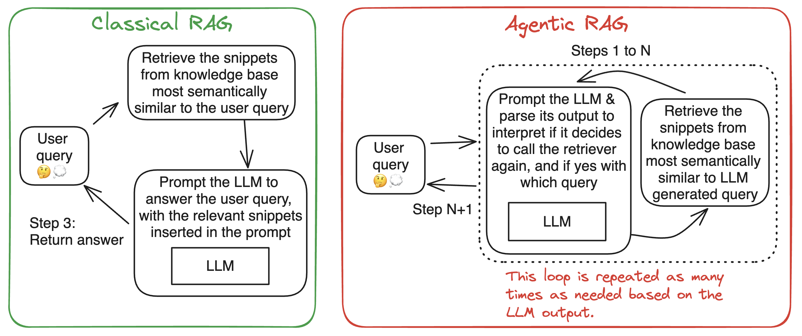

# Agentic Retrieval-Augmented Generation (RAG) with ChromaDB

This repository provides an agentic Retrieval-Augmented Generation (RAG) system using ChromaDB for efficient semantic search. It leverages `smolagents` for agent-based interactions and supports various LLM sources, including `LiteLLM`, `HfApi`, and `Transformers`. The system is designed to retrieve relevant documentation snippets from Hugging Face Docs and assist in answering user queries with contextual accuracy.

## Features
- **Agentic RAG**: Uses a retrieval agent to enhance LLM responses.
- **ChromaDB Vector Store**: Efficiently stores and retrieves document embeddings.
- **Multiple LLM Support**: Works with `LiteLLM`, `HfApi`, and `Transformers` models.
- **Semantic Search**: Retrieves relevant documents using HuggingFace embeddings.
- **Gradio UI**: Provides an interactive web interface for easy usage.

## What's the Agentic RAG?
Here is an illustration for two different system that perform Retrieval Augmented Generation: one is the classical, its graph is fixed. But the other is agentic, one loop in the graph can be repeated as needed.

[image source](https://huggingface.co/blog/beating-gaia)

## Quick Start
- Clone the repo.
- Install [uv](https://docs.astral.sh/uv/), as the project manager.
- Run the following command:
```bash
cd agentic_rag
uv run agentic_rag_chromadb.py
```

This will:
1. Load or prepare a ChromaDB vector store.
2. Initialize the retrieval tool for semantic search.
3. Launch a Gradio-based UI for user interaction.
4. Reuse your persisted vector store (if any)

## Usage
Once the system is running, you can:
- Input queries about Hugging Face documentions.
- Retrieve relevant information from the vector store.
- Utilize an LLM model to process and generate responses.


## License
See `LICENSE` for more details.

## Contributing
Feel free to submit issues and pull requests! 🚀

